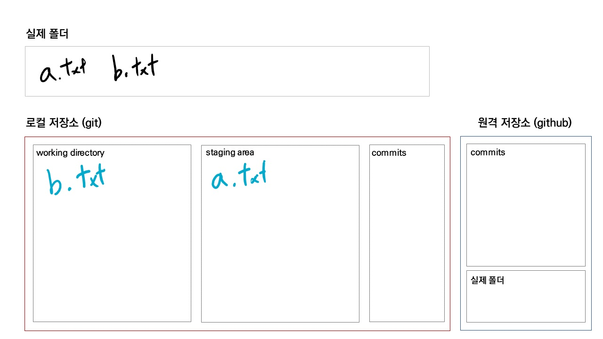
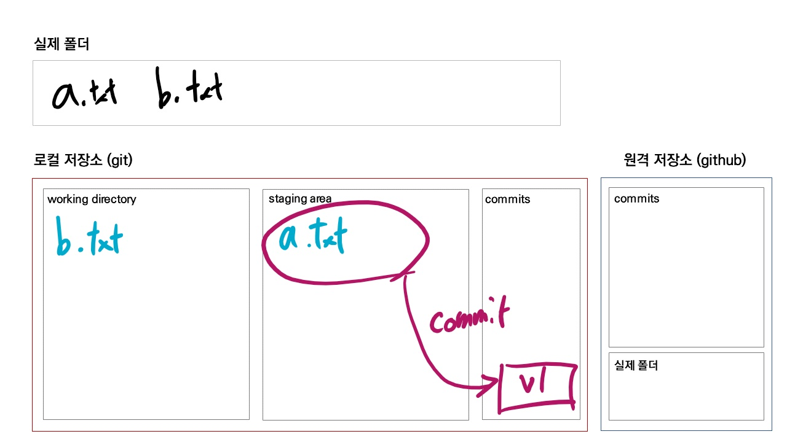

[toc]

## Git 초기 설정

**커밋 작성자(author) 설정**

```bash
$ git config --global user.email "메일주소"
$ git config --global user.name "유저네임"
```

- 커밋을 작성하는 사람이 누구인지 알아야하기 때문

<br>

지정된 설정 확인

```bash
$ git config --global -l
# $ git config --global --list
```

<br>

**커밋 편집기 변경**

```bash
$ git config --global core.editor "code --wait"
```

- 해당 명령어는 반드시 vscode가 설치되어 있어야 함

> 기본 텍스트 편집기 `vim`을 `vscode`로 대체하는 것

<br>

---

## Git Basic

### 로컬 저장소 설정

```bash
$ git init

Initialized empty Git repository in C:/Users/student/Desktop/git_class

student@M172 MINGW64 ~/Desktop/git_class (master)
```

- 폴더에 git 저장소를 초기화하면,
  - `.git` 숨김 폴더가 생기고
  - bash에는 `(master)`라고 표기 된다.

> 주의사항
>
> - git 저장소 내에 또다른 git 저장소를 만들면 안됨 !!
> - `git init` 명려어를 입력할 때, `(master)`가 있으면 절대! 입력하지 말 것!

<br>

### add

> staging area / INDEX

```bash
$ git add 파일명
$ git add . # 현재 디렉토리(하위 디렉토리)
$ git add a.txt # 특정 파일
$ git add my_folder/ # 특정 폴더
```

- `working directory` 상태의 파일을 `staging area`상태로 변경
- 커밋을 위한 파일 및 폴더들을 추가하는 명령어

```bash
$ touch a.txt b.txt

$ git status
On branch master

No commits yet

Untracked files: # 트래킹 되고 있지 않는 파일 목록
  (use "git add <file>..." to include in what will be committed)
        a.txt
        b.txt

nothing added to commit but untracked files present (use "git add" to track)
```

```bash
$ git add a.txt
```

```bash
$ git status

On branch master

No commits yet

Changes to be committed: # 커밋 예정인 변경사항(staging area)
  (use "git rm --cached <file>..." to unstage)
        new file:   a.txt

Untracked files: # 트래킹 되고 있지 않은 파일
  (use "git add <file>..." to include in what will be committed)
        b.txt
```

> 모든 정보는 `git status` 에 있다.



<br>

### commit

```bash
$ git commit -m "first commit"
[master (root-commit) c02659f] first commit
 1 file changed, 0 insertions(+), 0 deletions(-)
 create mode 100644 a.txt
```

```bash
$ git log
commit c02659fc917b40f1ab6106a1727703a7884df12e (HEAD -> master)
Author: edujunho <edujunho.hphk@gmail.com>
Date:   Mon Jun 7 15:29:54 2021 +0900

    first commit
```

```bash
$ git status
On branch master
Untracked files:
  (use "git add <file>..." to include in what will be committed)
        b.txt

nothing added to commit but untracked files present (use "git add" to track)
```

- 커밋을 통해 하나의 버전으로 기록 됨
- 커밋 메세지는 현재 변경사항들을 잘 나타낼 수 있도록 작성하는 것을 권장
- 커밋은 고유한 아이디인 해시 값을 가짐
  - SHA-1 알고리즘에 의해 생성
- 커밋 목록은 `git log`를 통해서 확인할 수 있음

```bash
$ git log --oneline # 커밋 목록 한 줄로 보기
c02659f (HEAD -> master) first commit
```



---

### status

- working directory, staging area 공간의 파일 상태를 확인할 수 있다.

```bash
$ git status
```

_LI.jpg)

<br>

---

<br>

### 추가 커밋 쌓기

- a.txt 내용 수정

```bash
$ git status
On branch master
Changes not staged for commit:
  (use "git add <file>..." to update what will be committed)
  (use "git restore <file>..." to discard changes in working directory)
        modified:   a.txt

Untracked files:
  (use "git add <file>..." to include in what will be committed)
        b.txt

no changes added to commit (use "git add" and/or "git commit -a")
```

```bash
$ git add a.txt

$ git status
On branch master
Changes to be committed:
  (use "git restore --staged <file>..." to unstage)
        modified:   a.txt

Untracked files:
  (use "git add <file>..." to include in what will be committed)
        b.txt
```

```bash
$ git commit -m "second commit"

[master 4cac5c6] second commit
 1 file changed, 1 insertion(+)
```

```bash
$ git log --oneline
4cac5c6 (HEAD -> master) second commit
c02659f first commit
```

- b.txt 커밋 만들기

```bash
$ git add b.txt

$ git status
On branch master
Changes to be committed:
  (use "git restore --staged <file>..." to unstage)
        new file:   b.txt

$ git commit -m "add b.txt"
[master 6fe9152] add b.txt
 1 file changed, 0 insertions(+), 0 deletions(-)
 create mode 100644 b.txt
```

```bash
$ git log --oneline
6fe9152 (HEAD -> master) add b.txt
4cac5c6 second commit
c02659f first commit
```
